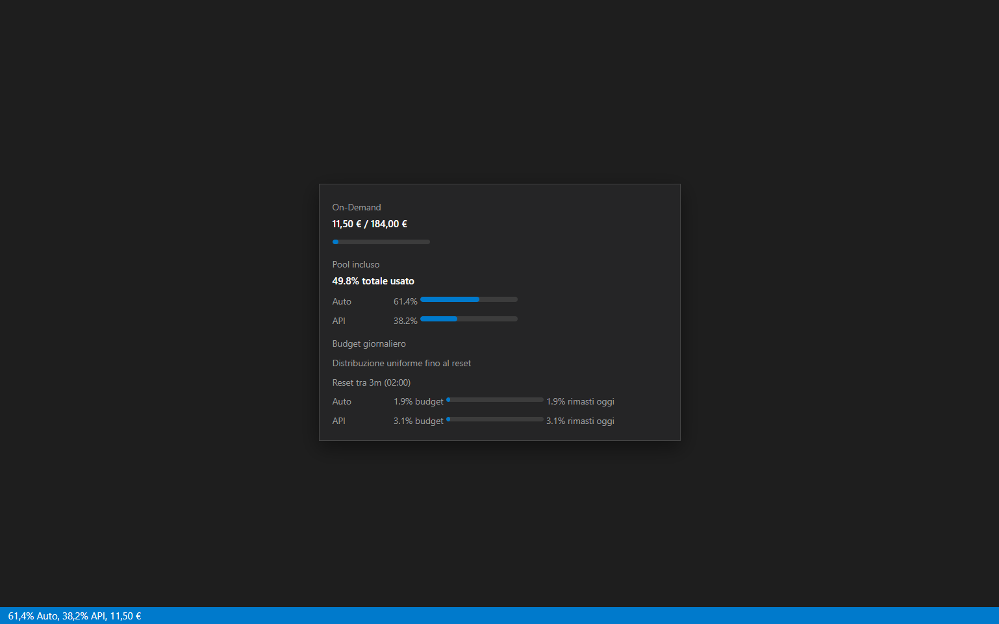
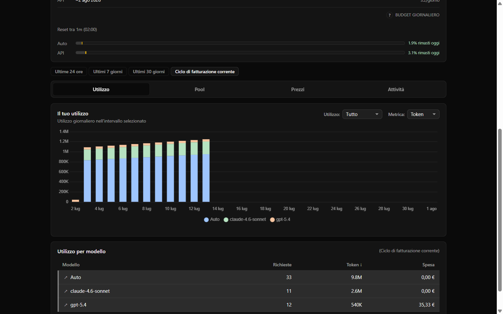
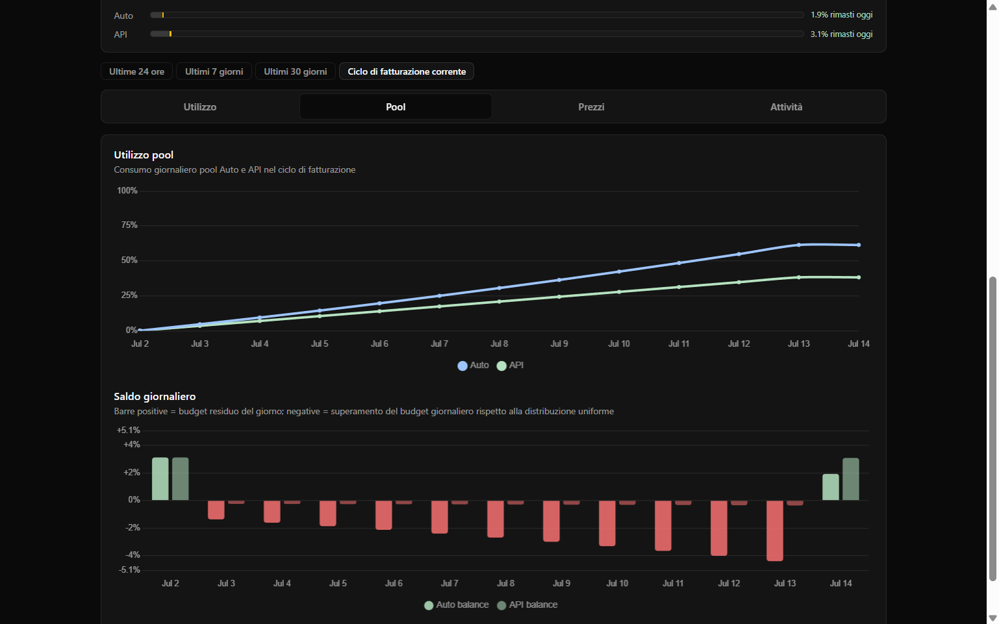
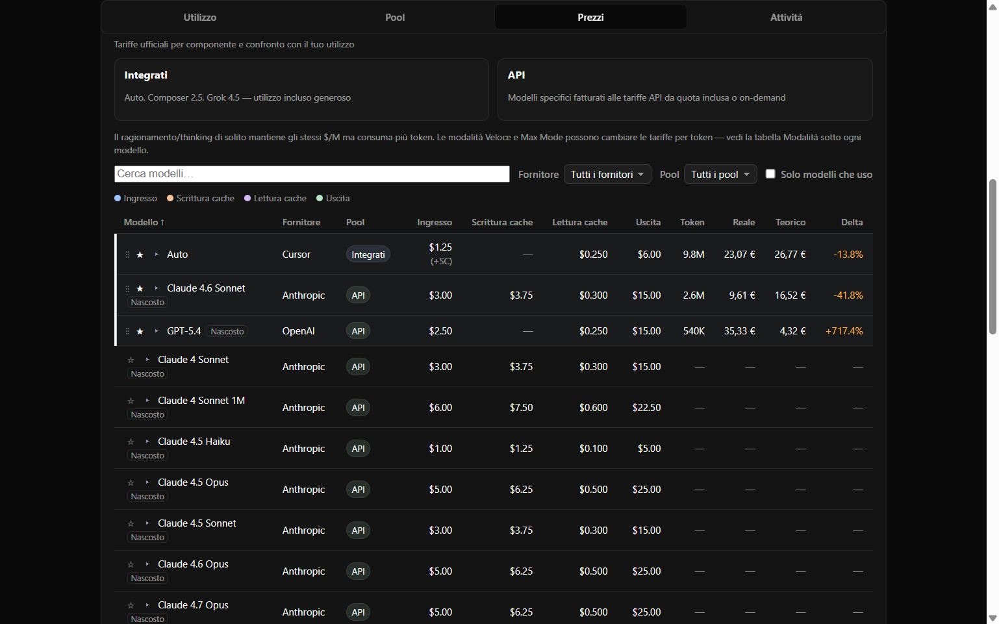
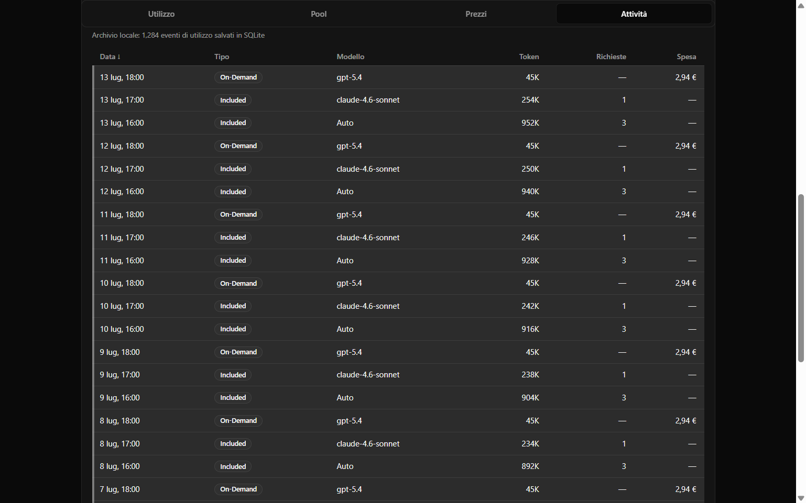

# Cursor Usage (Community)

Community-maintained fork of [cursor-metrics](https://github.com/wrick17/cursor-metrics). See Cursor usage in your status bar: included requests, Auto/API pool usage, and on-demand spend, live while you work. Click the status bar item to open a full dashboard inside your editor.











## What you get

### Status bar

- Compact display depends on your plan:
  - **Team / Enterprise (pool-based):** for example `61% Auto, 100% API, $12.50`
  - **Legacy personal (request-based):** for example `42/500, $0.00`
- On pool-based plans, Auto and API show how much of each included pool has been consumed (First-party vs third-party models).
- Detailed hover tooltip with progress bars, included pool breakdown (Auto/API), **daily budget** (allowance and residual for Auto/API today), reset countdown, and per-model usage.
- Loading indicator while fresh usage data is being fetched.
- Smart refresh behavior tied to editor activity and window focus.
- Optional minimal mode to show only the active metric.

### Dashboard

- **Summary cards** for on-demand spend and included pools (Auto / API / total). Legacy request-quota card appears only on older personal plans without pool data.
- **Included pool card extras** (Team / Enterprise):
  - Projected date each pool hits 100% at the current average consumption rate since cycle start.
  - **Target usage** — cumulative target if spread evenly until reset, compared with actual Auto/API usage.
  - **Daily budget** — daily allowance bar with residual headroom or overspend vs an even spread.
- **Pool Usage section** (when pool data is available):
  - Cumulative Auto/API % line chart for the billing cycle.
  - **Daily balance** chart — positive bars = budget left that day; negative = overspend vs even spread.
- **Your Usage** — stacked per-day bar chart (spend, tokens, or requests) with range tabs and usage filters.
  - Chart tooltip includes per-model values **and daily pool %** (Auto/API consumed that day).
- **Usage by Model** — sortable breakdown table with chart-matched colors.
- **Events** — paginated, sortable event log with token breakdown modal and CSV export.
- **Language selector** (`EN` / `IT`) in the header next to Refresh; choice is persisted.
- **Sticky main tabs:** **Usage**, **Pools**, **Pricing**, and **Activity** (events / conversations).
- **Pricing tab** with official per-component model rates, variant modes, token cost calculator, actual vs theoretical spend comparison, and pin/reorder for favorite models.
- **Daily budget reset countdown** on the pool card (renews at midnight UTC).
- Collapsible sections with persisted open/closed state.

Screenshots above use Italian (IT) and EUR; regenerate with `bun run screenshots` after `bun install`.

## Commands

- `Cursor Usage (Community): Open Dashboard` — open the in-editor dashboard.
- `Cursor Usage (Community): Show Details` — show a quick usage summary message.
- `Cursor Usage (Community): Refresh` — force a refresh immediately.

## Settings

- `cursorUsage.pollInterval` (default: `5`) — minimum refresh cooldown in minutes (`1`, `5`, `10`, `30`, `60`).
- `cursorUsage.minimalMode` (default: `false`) — when included usage is exhausted (pool total on Team/Enterprise, or legacy request quota on older personal plans), show only on-demand spend in the status bar instead of the full summary.
- `cursorUsage.usageDuration` (default: `billingCycle`) — tooltip model-usage range: `1d`, `7d`, `30d`, or `billingCycle`.
- `cursorUsage.modelBreakdownSortBy` (default: `tokens`) — sort column for usage-by-model tables: `model`, `requests`, `tokens`, `spend`.
- `cursorUsage.modelBreakdownSortOrder` (default: `desc`) — `asc` or `desc`.
- `cursorUsage.excludeZeroTokenModels` (default: `false`) — hide model rows with zero tokens in the tooltip breakdown.
- `cursorUsage.quotaAwareEventDisplay` (default: `true`) — in the dashboard, show included usage as requests and on-demand usage as spend instead of raw charged cents on every row.

## Pool pacing (how to read it)

All pool pacing views are **indicative** — they assume an even spread of the 100% pool budget across the billing cycle:

| View | What it shows |
|------|----------------|
| **Daily budget** | Daily allowance and how much is still available today (or by how much you overshot it). Shown in the status bar tooltip and dashboard pool card. |
| **Target usage** | Where cumulative Auto/API usage *should* be today to reach reset without early depletion (dashboard pool card). |
| **Daily balance chart** | Per-day headroom (+) or overspend (−) relative to that even spread. |
| **Projected 100%** | When each pool would hit 100% if the average daily rate since cycle start continues. |
| **Chart tooltip pool %** | Auto and API pool percentage consumed on that specific day. |

Daily pool percentages are derived from included usage events (`default` model → Auto pool; other models → API pool) and calibrated against the live totals from Cursor's usage API.

## Privacy and behavior

- No manual API key setup required.
- Uses your existing signed-in Cursor session locally.
- Fetches on activity (editing/focus) instead of constant polling.
- Caches auth and API responses to avoid redundant requests.

## Development

### Prerequisites

- [Bun](https://bun.sh/) 1.x
- [Cursor](https://cursor.com/) or [VS Code](https://code.visualstudio.com/) 1.85+
- For packaging and publishing: network access (Chart.js download, `@vscode/vsce`, `ovsx` via `bunx`)

### Clone and install

```bash
git clone https://github.com/FaberVi/cursor-metrics.git
cd cursor-metrics
bun install
```

### Local development

```bash
bun run watch      # rebuild extension + dashboard on file changes
bun run build      # one-off production build
bun test           # run tests
```

Press **F5** in VS Code/Cursor with the **Run Cursor Usage Extension** launch config to debug in an Extension Development Host.

The production build:

1. Downloads Chart.js into `media/dashboard/chart.umd.js`
2. Bundles `src/extension.ts` → `dist/extension.js`
3. Bundles the dashboard entry → `media/dashboard/dashboard.js`

### Build a VSIX locally

The extension is published under two package IDs on different marketplaces:

| Marketplace | Package ID | VSIX filename | Script |
|-------------|------------|---------------|--------|
| [Open VSX](https://open-vsx.org/) | `cursor-usage` | `build/cursor-usage-<version>.vsix` | `bun run package` |
| [Visual Studio Marketplace](https://marketplace.visualstudio.com/) | `cursor-usage-auto` | `build/cursor-usage-auto-<version>.vsix` | `bun run package:vsm` |

The VS Marketplace build stages a copy of the extension with `name: cursor-usage-auto` (see `scripts/prepare-vsm-package.mjs`) so it can coexist with the original upstream listing.

Create the Open VSX artifact:

```bash
bun run package
```

Create the Visual Studio Marketplace artifact:

```bash
bun run package:vsm
```

Install a VSIX locally for smoke testing:

```bash
# Cursor
cursor --install-extension build/cursor-usage-0.7.1.vsix

# VS Code
code --install-extension build/cursor-usage-0.7.1.vsix
```

Replace `0.7.1` with the version from `package.json`.

### Publish to marketplaces

Publisher: **[fabervi](https://marketplace.visualstudio.com/publishers/fabervi)**

#### Before each release

1. Bump `version` in `package.json`
2. Add a dated entry to `CHANGELOG.md`
3. Run `bun test`
4. Build both VSIX files and smoke-test at least one of them locally
5. Set the publish tokens (see below)

#### Open VSX

1. Create an account on [open-vsx.org](https://open-vsx.org/)
2. Generate a personal access token
3. Set `OPEN_VSX_TOKEN` in your environment

**PowerShell (Windows):**

```powershell
$env:OPEN_VSX_TOKEN = "your-open-vsx-token"
bun run package
bun run publish:ovsx
```

**bash (macOS / Linux / Git Bash):**

```bash
export OPEN_VSX_TOKEN="your-open-vsx-token"
bun run package
bun run publish:ovsx
```

#### Visual Studio Marketplace

1. Create or use the [fabervi](https://marketplace.visualstudio.com/publishers/fabervi) publisher on the Visual Studio Marketplace
2. Create an Azure DevOps [Personal Access Token](https://learn.microsoft.com/en-us/azure/devops/organizations/accounts/use-personal-access-tokens-to-authenticate) with **Marketplace > Manage** scope
3. Set `VSCE_PAT` in your environment

**PowerShell (Windows):**

```powershell
$env:VSCE_PAT = "your-vsce-pat"
bun run publish:vsm
```

**bash:**

```bash
export VSCE_PAT="your-vsce-pat"
bun run publish:vsm
```

`publish:vsm` runs `package:vsm` first, then uploads `build/cursor-usage-auto-<version>.vsix`.

#### Full release (both stores)

With both tokens set:

```bash
bun run release
```

This runs, in order: `package` → `publish:ovsx` → `publish:vsm` (package + publish for VS Marketplace).

#### Manual publish (alternative)

If you prefer not to use the npm scripts:

```bash
bunx @vscode/vsce publish --packagePath build/cursor-usage-auto-<version>.vsix -p "$VSCE_PAT"
bunx ovsx publish build/cursor-usage-<version>.vsix -p "$OPEN_VSX_TOKEN"
```

## Authors & maintainers

- **Created by** [wrick17](https://github.com/wrick17) — original extension and [cursor-metrics](https://github.com/wrick17/cursor-metrics) repository.
- **Maintained by** [Vincenzo Fabiano (FaberVi)](https://github.com/FaberVi) — community fork, pool analytics, dashboard i18n, pacing projections, and ongoing improvements. Published on the VS Marketplace as [fabervi](https://marketplace.visualstudio.com/publishers/fabervi).

## License

MIT
